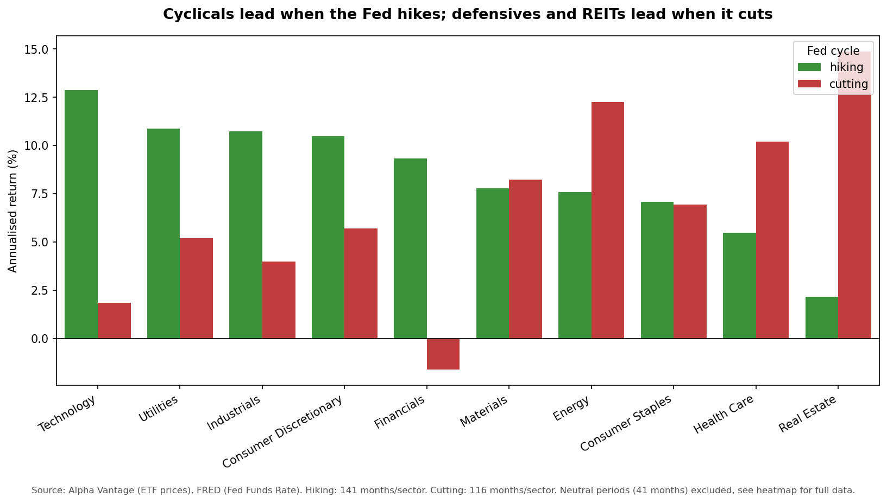
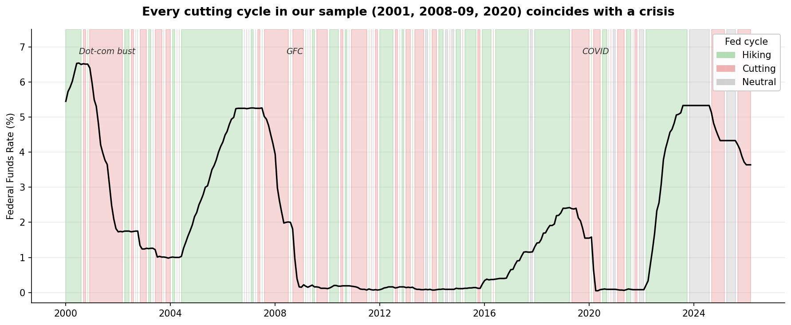

# Sector Rotation and the Fed

**The headline.** Across 2000 to 2026, US equity sectors split cleanly along cyclicality when grouped by Fed rate regime. Cyclicals lead during hiking cycles; defensives and Real Estate lead during cutting cycles.

**The caveat.** All three cutting cycles in our sample coincide with recessions (2001, 2008-09, 2020), so cutting-cycle returns reflect crisis dynamics, not normal monetary easing.

---

## The question

How do US equity sector returns vary across Federal Reserve rate hiking and cutting cycles, and which sectors consistently rotate into outperformance as monetary policy shifts?

We use the ten SPDR sector ETFs (XLK, XLF, XLE, XLV, XLU, XLY, XLP, XLI, XLB, XLRE) and classify every month from January 2000 to March 2026 into a rate regime based on the direction of the Federal Funds Rate. Then we compare annualised sector returns across regimes.

---

## Method, briefly

We pulled the Federal Funds Rate, CPI, and the 10Y-2Y yield spread from FRED, and monthly prices for the ten sector ETFs from Alpha Vantage. Rate regimes were labelled using a rolling 3-month mean of monthly Fed Funds Rate changes: positive means hiking, negative means cutting, zero or undefined means neutral.

Before any aggregation we verified completeness across the 2,959 sector-months and confirmed the XLRE coverage gap (124 observations versus 315 elsewhere) that shapes our limitations section. The full pipeline is three notebooks in the repo. NB01 collects raw JSON. NB02 cleans, joins, and writes to a SQLite database. NB03 reads from the database and produces the analysis below.

---

## Finding 1 — Cyclicals lead in hiking cycles, defensives lead in cutting cycles

The split runs cleanly along sector cyclicality. Technology, Utilities, Industrials, Consumer Discretionary and Financials all post higher annualised returns when the Fed is hiking than when it is cutting. Technology and Financials show the widest gap, around 11 percentage points each, and Financials is the only sector with a negative cutting-cycle return.

Health Care and Real Estate flip the other way, with cutting-cycle returns above their hiking-cycle returns. Consumer Staples is roughly flat across the two regimes. Materials and Energy sit between the two camps with broadly similar returns in both. Energy in particular has a high cutting-cycle figure at 12.2%, which lines up with energy prices spiking during some of the crisis-driven easing periods in the sample.

The neutral regime is left out of this chart deliberately. With only 41 months across 10 sectors and those months clustering in calm late-cycle bull runs, including neutral would flatter every sector indiscriminately and dilute the contrast that actually matters.

---

## Finding 2 — Cyclicals and defensives are mirror images across regimes

The bar chart above strips the story down. The table below shows the full picture, with the neutral column included for transparency.

| Sector | Cutting | Neutral | Hiking |
|---|---|---|---|
| Technology | 1.9% | 28.8% | 12.9% |
| Utilities | 5.2% | 19.0% | 10.9% |
| Industrials | 4.0% | 32.2% | 10.7% |
| Consumer Discretionary | 5.7% | 30.6% | 10.5% |
| Financials | -1.6% | 37.7% | 9.3% |
| Materials | 8.2% | 23.2% | 7.8% |
| Energy | 12.2% | 30.6% | 7.6% |
| Consumer Staples | 6.9% | 17.3% | 7.1% |
| Health Care | 10.2% | 17.2% | 5.5% |
| Real Estate | 14.9% | 14.7% | 2.2% |

The hiking and cutting columns are roughly mirror images. Sectors that lead in hiking tend to lag in cutting and vice versa. The neutral column is the highest for nine of the ten sectors, but that is not really telling us anything about how sectors behave in neutral periods. The 41 months in the neutral bucket happen to cluster in calm late-cycle bull runs that lifted almost everything, so the column ends up flattering every sector indiscriminately.

The Real Estate cutting-cycle figure of 14.9% should be read with extra caution. XLRE only launched in October 2015, so its cutting-cycle exposure is the 2020 COVID episode alone, not three cutting cycles like every other sector. One event rather than a pattern.

---

## Finding 3 — Every cutting cycle in this sample is a recession

The chart above shows what each regime produced. This one shows when each regime actually happened, which matters because the three cutting cycles in the sample all coincide with US recessions. The red blocks at 2001-2003 (dot-com bust), 2007-2009 (GFC) and 2020 (COVID) are the only cutting episodes in the data. The Fed didn't cut rates in this sample without a crisis driving the decision.

That means the cutting-cycle returns in the bar chart and heatmap are crisis-conditioned rather than regime-conditioned in any clean theoretical sense. Any reading of "how sectors perform when the Fed is cutting" should really be read as "how sectors perform when the Fed is cutting in a recession". A sample including a soft-landing cut would likely look different.

The shading is also noisy during flat-rate periods (most visibly 2010-2015 and 2021-2022). Where the Fed held rates flat, small month-to-month wobbles flipped the rolling-mean signal back and forth between hiking and cutting. The aggregated returns are robust to this because each regime cell averages over 100+ months, but the noise is worth showing rather than hiding. This is tracked in repo Issue #9.

---

## Limitations

Four caveats apply to the findings above.

1. **Cutting cycles are all crisis-driven.** The three cutting cycles in the sample (2001, 2008-09, 2020) all coincide with recessions. Cutting-cycle returns reflect crisis dynamics rather than normal monetary easing.
2. **Real Estate has a short history.** XLRE launched October 2015 and has 124 observations versus 315 for every other sector. Its cutting-cycle figure reflects only the 2020 episode.
3. **The neutral sample is small.** Only 41 months across 10 sectors, dominated by benign late-cycle bull runs. Excluded from the headline chart for this reason.
4. **The rate_cycle labelling is noisy in flat-rate periods.** Tracked in repo Issue #9. The aggregated results are not materially affected because each cell averages over 100+ months.

### What this analysis does not claim

**This is a conditional-mean comparison, not a causal claim.** Fed policy and sector returns are both driven by the underlying economic regime, and the analysis cannot separate "the Fed cut rates and therefore these sectors did well" from "a recession was happening, the Fed cut rates because of it, and these sectors did well for separate reasons".

---

## Reproducing the analysis

1. Clone the repository: `git clone https://github.com/lse-ds105/group-project-git-it-done`
2. Create a `.env` file in the root with `FRED_API_KEY=your_key` and `ALPHA_VANTAGE_KEY=your_key`
3. Install dependencies (pandas, numpy, matplotlib, seaborn, requests, python-dotenv)
4. Run the notebooks in order: NB01 → NB02 → NB03
5. Outputs land in `data/processed/analysis/` and `docs/figures/`

---

## Team

- **Hugo Whyte** — NB01, data collection from FRED and Alpha Vantage
- **Parthiv Chakadath** — NB02, data cleaning and SQLite database
- **Joel Saldanha** — NB03, analysis, visualisations, and this website

Repo: [github.com/lse-ds105/group-project-git-it-done](https://github.com/lse-ds105/group-project-git-it-done)